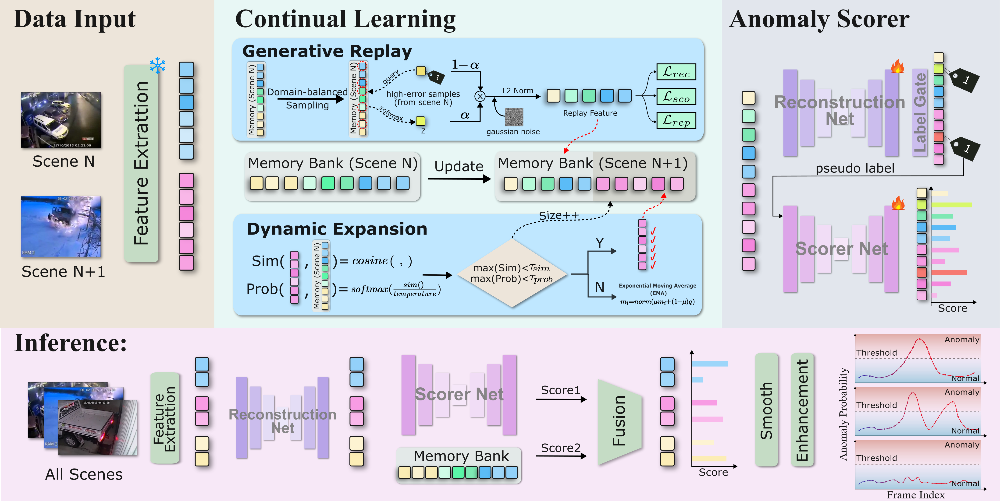

# Continual VAD: Memory-Driven Generative Replay and Dynamic Expansion for Cross-Scene Video Anomaly Detection

This repository provides the **test-only release** for the paper:

**Continual VAD: Memory-Driven Generative Replay and Dynamic Expansion for Cross-Scene Video Anomaly Detection**

The released code evaluates continual video anomaly detection models on ShanghaiTech and UCF-Crime. The full-data settings for ShanghaiTech and UCF-Crime use the same standard evaluation interface, and the incremental settings use the corresponding continual scene/domain checkpoints.



## Overview

Continual VAD studies video anomaly detection under cross-scene or cross-domain continual learning. The method uses memory-driven generative replay and dynamic memory expansion to reduce forgetting while adapting to new scenes.

This repository contains the evaluation pipeline, model definition, feature dataset loader, environment file, fixed checkpoint interface, and wrapper script required to reproduce the released test results.

## Repository Contents

The current test-only repository contains the following files:

| Path | Description |
| --- | --- |
| `eval.py` | Unified evaluation entry point for all four tasks. It loads checkpoints, runs inference, applies the fixed evaluation settings, and reports metrics. |
| `models.py` | Model definitions used by the released checkpoints, including the memory bank, replay modules, dynamic expansion logic, and anomaly scorer. |
| `options.py` | Command-line options used by the evaluation entry point. |
| `run_eval.sh` | Shell wrapper with the fixed settings for ShanghaiTech full, ShanghaiTech incremental, UCF-Crime full, and UCF-Crime incremental evaluation. |
| `video_dataset_anomaly_balance_uni_sample_ucf.py` | Feature dataset loader for the prepared feature files. |
| `utils.py` | Small utility functions used by the evaluation pipeline. |
| `environment.yaml` | Conda environment specification. |
| `bestckpt/` | Directory expected to contain the released checkpoints. |
| `cvad_main_figure.png` | Main overview figure for the method. |

## Code To Be Released Later

The following components are planned for the full code release:

| Component | Description |
| --- | --- |
| Training scripts | Full-data and incremental training entry points for ShanghaiTech and UCF-Crime. |
| Data preparation scripts | Scripts for constructing feature files, scene/domain splits, and DIL evaluation files. |
| Experiment configurations | Reproducible settings for ablations, sensitivity analysis, and additional comparisons. |
| Additional checkpoints and logs | Optional trained checkpoints and experiment logs, subject to release policy. |

## Environment Setup

Create the conda environment from the provided file:

```bash
conda env create -f environment.yaml
conda activate py36_torch18
```

If your local conda environment name differs, activate the environment name shown by:

```bash
conda env list
```

## Datasets

This repository evaluates on prepared ShanghaiTech and UCF-Crime feature files. The released feature dataset is provided as `ContinualVAD_Dataset` and can be used directly with the evaluation scripts.

| Dataset | Link |
| --- | --- |
| ContinualVAD_Dataset | [Quark Drive](https://pan.quark.cn/s/4e69ca3d4d68) |

After downloading the prepared features, set the following environment variables before running evaluation:

| Variable | Description |
| --- | --- |
| `SH_ROOT` | Root directory for ShanghaiTech evaluation files. |
| `SH_DIL_ROOT` | Root directory for ShanghaiTech continual/DIL split files. |
| `SH_FULL_TRAIN` | ShanghaiTech full-data feature file used by the evaluation loader. |
| `SH_INC_TRAIN` | Optional ShanghaiTech incremental feature file. If unset, the script uses the default scene split under `SH_DIL_ROOT`. |
| `UCF_ROOT` | Root directory for UCF-Crime evaluation files. |
| `UCF_DIL_ROOT` | Root directory for UCF-Crime continual/DIL split files. |
| `UCF_FULL_TRAIN` | UCF-Crime full-data feature file used by the evaluation loader. |
| `UCF_INC_TRAIN` | Optional UCF-Crime incremental feature file. If unset, the script uses the default domain split under `UCF_DIL_ROOT`. |

Example:

```bash
export DATA_ROOT=/path/to/ContinualVAD_Dataset

export SH_ROOT=${DATA_ROOT}/ShanghaiTech
export SH_DIL_ROOT=${DATA_ROOT}/ShanghaiTech/continual_split
export SH_FULL_TRAIN=${DATA_ROOT}/ShanghaiTech/full_train.npy

export UCF_ROOT=${DATA_ROOT}/UCF-Crime
export UCF_DIL_ROOT=${DATA_ROOT}/UCF-Crime/continual_split
export UCF_FULL_TRAIN=${DATA_ROOT}/UCF-Crime/full_train.npy
```

Each DIL split root should contain the global test feature and ground-truth files required by `run_eval.sh`:

```text
global_test.npy
global_test_gt.npy
global_build_meta.json
```

For incremental evaluation, the split root should also contain the corresponding scene/domain training feature files.

## Checkpoints

Place the released checkpoints under `bestckpt/` with the following names:

```text
bestckpt/
  sh_full.pkl
  sh_incremental.pkl
  ucf_full.pkl
  ucf_incremental.pkl
```

You can override the checkpoint path for any task by setting the corresponding environment variable:

| Task | Default checkpoint | Override variable |
| --- | --- | --- |
| `sh_full` | `bestckpt/sh_full.pkl` | `SH_FULL_CKPT` |
| `sh_inc` | `bestckpt/sh_incremental.pkl` | `SH_INC_CKPT` |
| `ucf_full` | `bestckpt/ucf_full.pkl` | `UCF_FULL_CKPT` |
| `ucf_inc` | `bestckpt/ucf_incremental.pkl` | `UCF_INC_CKPT` |

You can also set `CKPT=/path/to/checkpoint.pkl` to override the checkpoint for a single run.

## Running Evaluation

Run one task from the repository root:

```bash
GPU=0 TASK=sh_full bash run_eval.sh
GPU=0 TASK=sh_inc bash run_eval.sh
GPU=0 TASK=ucf_full bash run_eval.sh
GPU=0 TASK=ucf_inc bash run_eval.sh
```

Or run the four tasks on separate GPUs:

```bash
GPU=0 TASK=sh_full bash run_eval.sh
GPU=1 TASK=sh_inc bash run_eval.sh
GPU=2 TASK=ucf_full bash run_eval.sh
GPU=3 TASK=ucf_inc bash run_eval.sh
```

The supported tasks are:

| Task | Setting |
| --- | --- |
| `sh_full` | ShanghaiTech full-data evaluation. |
| `sh_inc` | ShanghaiTech incremental scene evaluation. |
| `ucf_full` | UCF-Crime full-data evaluation. |
| `ucf_inc` | UCF-Crime incremental domain evaluation. |

## Released Checkpoint Results

The released checkpoints are expected to reproduce the following AUC results with the fixed evaluation commands above:

| Task | Setting | AUC |
| --- | --- | ---: |
| `sh_full` | ShanghaiTech full-data evaluation | 0.8525966192201812 |
| `sh_inc` | ShanghaiTech incremental scene evaluation | 0.8414178130890702 |
| `ucf_full` | UCF-Crime full-data evaluation | 0.7667800027742104 |
| `ucf_inc` | UCF-Crime incremental domain evaluation | 0.7204023222728475 |

## Output

Evaluation results are written to:

```text
results/<task>/eval.json
results/<task>/eval.csv
```

The JSON and CSV files contain the same metric fields printed in the terminal.

## Notes

- This is a test-only repository. Training code is not included in this release.
- No private paths are required by the code. Configure all data and checkpoint locations through environment variables.
- The prepared feature dataset is released as `ContinualVAD_Dataset`; configure local paths through environment variables.

## Citation

If you find this repository useful, please cite the Continual VAD paper.

```bibtex
@article{continualvad2026,
  title={Continual VAD: Memory-Driven Generative Replay and Dynamic Expansion for Cross-Scene Video Anomaly Detection},
  author={Anonymous},
  journal={arXiv preprint},
  year={2026}
}
```


